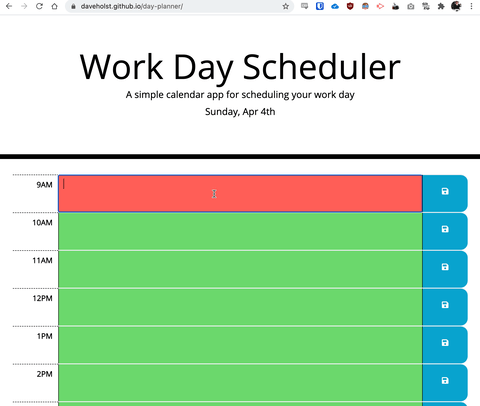

# Day Planner WebApp

## Task

Create a simple calendar application that allows a user to save events for each hour of the day by modifying starter code. This app will run in the browser and feature dynamically updated HTML and CSS powered by jQuery.

You'll need to use the [Moment.js](https://momentjs.com/) library to work with date and time. Be sure to read the documentation carefully and concentrate on using Moment.js in the browser.

## Link

A live example version of the site can be found on GitHub Pages (https://daveholst.github.io/day-planner/)

## Screenshot

## User Story

**AS AN** employee with a busy schedule\
**I WANT** to add important events to a daily planner\
**SO THAT** I can manage my time effectively

## Acceptance Criteria

- **GIVEN** I am using a daily planner to create a schedule
- **WHEN** I open the planner
- [x] **THEN** the current day is displayed at the top of the calendar
- **WHEN** I scroll down
- [x] **THEN** I am presented with timeblocks for standard business hours
- **WHEN** I view the timeblocks for that day
- [x] **THEN** each timeblock is color coded to indicate whether it is in the past, present, or future
- **WHEN** I click into a timeblock
- [x] **THEN** I can enter an event
- **WHEN** I click the save button for that timeblock
- [x] **THEN** the text for that event is saved in local storage
- **WHEN** I refresh the page
- [x] **THEN** the saved events persist

## dayPlanner Class

I have created Day planner class that can take arguments to change the initial generation of the object. A time slot will finish one second before the start of the next. in the example above, the first slot would be from 9:00:00am to 9:59:59am. Planner objects can be created using the following syntax:\
`let myDay = new DayPlanner(<start-time-string>, <end-time-string>, <time slot in mins>);`

Example:
`let myDay = new DayPlanner('09:00', '18:00', 60)`\
This would result in a day planner from 9am to 6pm with 60min timeslots.\
Note: 6pm is the end of the day. This will be converted to 17:59:59 and used to determine the finish of the last time slot.

If any of the arguments are changed it will result in a dynamic recalculated table.

The following methods are available.

`.writeFromLocal()` - stringifies and writes the object to localStorage\
`.buildFromLocal()` - rebuilds object from parsed JSON in localStorage\
`.tableBuilder()` - builds appropriate table elements to the DOM\
`.timeCalc(<modifier - integer in seconds)>,<loop incrementer>)` - used to calculate start and end time of timeslots during tableBuilder method.
